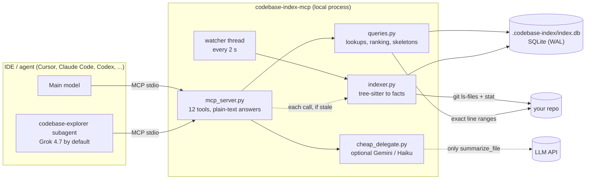
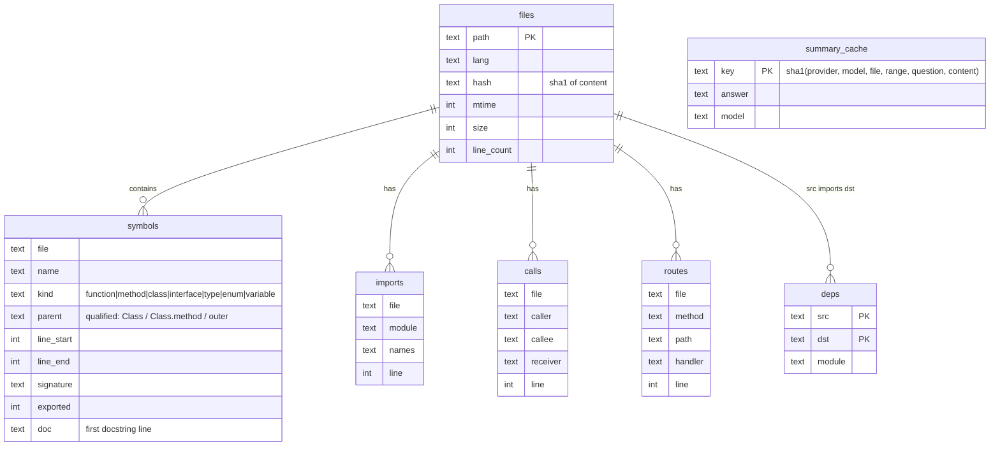

# codebase-index-mcp: guide

How it works, why it saves tokens, how to route questions, and how to extend it.
For installation, see the [README](../README.md).

1. [Architecture](#1-architecture)
2. [How it reduces input-token cost](#2-how-it-reduces-input-token-cost)
3. [Tools and output format](#3-tools-and-output-format)
4. [Intent routing: free tools vs cheap model vs subagent](#4-intent-routing-free-tools-vs-cheap-model-vs-subagent)
5. [Freshness](#5-freshness)
6. [Cursor subagent and model choice](#6-cursor-subagent-and-model-choice)
7. [What the parser extracts](#7-what-the-parser-extracts)
8. [Data model](#8-data-model)
9. [Adding a language](#9-adding-a-language)
10. [Layouts and multiple repos](#10-layouts-and-multiple-repos)
11. [Performance](#11-performance)
12. [Privacy](#12-privacy)

---

## 1. Architecture



- **indexer.py** lists files with `git ls-files` (so `.gitignore` is respected), `stat`s them, and
  re-parses only files whose mtime/size changed *and* whose SHA-1 differs. Each file becomes rows in
  `symbols`, `imports`, `calls` and `routes`. After any change, imports are resolved into a
  file→file `deps` table.
- **queries.py** answers tool calls from SQLite and, for source, reads the exact line range fresh from
  disk (so answers never show stale code).
- **mcp_server.py** exposes the tools over stdio. Stdout is the protocol channel; all logs go to stderr.

## 2. How it reduces input-token cost

Agents pay for **input tokens**, and every tool result stays in the conversation and is re-sent on every
later turn. A single 3,000-line file read early in a chat is paid for again on each following message.

Measured on a 749-file Python + React/TypeScript repo (204k lines):

| Task | Naive approach | This tool |
|---|---|---|
| Outline of a 5,195-line `.tsx` file | Read file: ~64,000 tokens | `get_file_summary`: ~2,700 |
| Code of a 4,028-line component | Read file: ~50,000 tokens | skeleton ~2,300, then 1–2 folded ranges |
| Find a symbol | Grep output + opening candidates | `search_symbol`: 50–700 |
| Repo orientation | 3–6 turns of ls / Glob / Read | `repo_map`: ~900 |
| Who calls `upgrade` | Grep + reading call sites | `find_callers`: ~250 |

Where the savings come from:

1. **Facts instead of files.** A signature plus a line range answers most "where/what" questions.
2. **Dense output.** Tools return plain text, one fact per line. The same search result as indented
   JSON was 1,234 tokens; as lines it is 710 (−42%). Tools are registered with
   `structured_output=False`, so clients do not also receive a duplicate JSON copy.
3. **Folded skeletons.** `read_symbol_source` on a huge symbol returns its shape: short statements
   verbatim, long ones folded to `... L1192-1217 folded (26 lines)`. The agent then reads only the
   ranges it needs.
4. **Batching.** `search_symbol("a, b, c")` and `read_symbol_source(symbol="a, B.c")` do several lookups
   in one round trip.
5. **Free intent hints.** The first line of each docstring / JSDoc comment is stored and shown in
   outlines and search results, which often answers "what is this for?" without reading the body.

## 3. Tools and output format

Example outputs (from the test fixture in `tests/test_index.py`):

```text
> search_symbol("UserService.save, getUser")
"UserService.save": 1 match
pkg/service.py:16-22 method UserService.save(self, user)  # Persist a user.

"getUser": 1 match
web/src/lib/api.ts:3-3 method api.getUser: async (id: string) =>

> get_file_summary("pkg/service.py")
pkg/service.py (python, 32 lines, 7 symbols; * = exported)
imports: .models, fastapi, pkg
routes: GET /users/{user_id} -> list_users
L6-6 router = APIRouter(prefix="/users")
L10-22 *class UserService  # Manages users.
  L13-14 def __init__(self, repo)
  L16-22 def save(self, user)  # Persist a user.
L25-28 *def list_users(user_id: int)
L31-32 def _private()
(+1 deeper nested symbols; pass depth=2 to show)

> find_callers("check", depth=2)
callers of check: 1 call sites in 1 files
defined: check pkg/util.py:1
pkg/service.py: L19 UserService.save._validate via util
transitive callers (up to depth 2):
  UserService.save._validate <- pkg/service.py:20 UserService.save

> read_symbol_source(symbol="Panel", mode="skeleton")
== web/src/components/Panel.tsx:5-17 Panel (13 lines) skeleton (folded blocks: read them with line_start/line_end)
export const Panel = forwardRef(function Panel(props: any, ref: any) {
  const [a, setA] = useState(0);
  const handleClick = useCallback(() => {
    ... L8-14 folded (7 lines)
  }, []);
  return <div onClick={handleClick}>{a}</div>;
});
```

`mode="auto"` (the default) returns full source when it fits in 300 lines and the skeleton otherwise.

Conventions:

- Locations are `path:start-end` (1-based, inclusive). Paths are repo-relative, `/`-separated.
- `*` marks exported/public symbols (Python: not `_`-prefixed, or listed in `__all__`; JS/TS: `export`).
- `# ...` after a line is the first docstring/JSDoc line.
- Nested symbols are qualified: `Class.method`, `Component.handleClick`, `outer.inner`.
- `via X` in `find_callers` is the receiver: `self.repo.save()` → `via repo`.

## 4. Intent routing: free tools vs cheap model vs subagent

| Question | Best route | Cost |
|---|---|---|
| Where / shape / callers / imports / routes / code of one function | Free tools | ~0 (local) |
| What does ONE file do? (key configured) | `summarize_file` | one small cheap-model call, cached |
| How does a feature work across files? (Cursor) | `codebase-explorer` subagent | subagent model usage (Grok 4.7 by default) |
| How does a feature work across files? (other clients) | free tools, then `read_symbol_source` on the few functions that matter | ~0 |

The routing is **guided, not enforced**. It comes from three places:

1. MCP server **instructions** (sent at initialize; many clients show them to the model).
2. The **tool descriptions** themselves.
3. A **rule file**: `.cursor/rules/codebase-index.mdc` (Cursor) or `rules/AGENTS.snippet.md` appended
   to `AGENTS.md` / `CLAUDE.md` / `GEMINI.md`.

## 5. Freshness

| Trigger | What happens |
|---|---|
| MCP server starts | background watcher syncs immediately, then every `CODEBASE_WATCH_INTERVAL` s (default 2) |
| Any tool call | syncs first if the watcher has not synced in the last interval + 1 s |
| `git commit/checkout/merge/rebase` | optional hooks start a detached `cli.py index --quiet` (`install_git_hooks.py`) |
| `reindex` tool / `cli.py index` | explicit sync (`--full` / `full=true` rebuilds) |

A sync with no changes costs one `git ls-files` plus a `stat` per source file (0.16 s for 749 files).
Changed files are hashed; only real content changes are re-parsed. All syncs share one lock, so the
watcher, tool calls and `reindex` never write concurrently. The index records the current git ref and
commit (`index_stats`), including for worktrees and packed refs.

Blind spot: **unsaved editor buffers.** Save before asking.

## 6. Cursor subagent and model choice

`setup_cursor.py` installs `.cursor/agents/codebase-explorer.md`:

```markdown
---
name: codebase-explorer
description: Read-only code explorer. Use for multi-file questions ...
model: grok-4.7
readonly: true
---
(instructions: use repo_map / search_symbol / read_symbol_source / find_callers ...,
 reply in under ~300 words with path:line references)
```

The always-on rule tells the main agent to hand multi-file questions to this subagent. The subagent does
the reading on a fast, cheap model and returns only a short answer, so the main (expensive) model's
context stays small.

**Default model: `grok-4.7`.** Change it in any of these ways:

| Where | How | Scope |
|---|---|---|
| Command line | `python setup_cursor.py --model <model-id>` | rewrites the agent file for that workspace |
| `.env` | `CURSOR_SUBAGENT_MODEL=<model-id>`, then `python setup_cursor.py` | default for every workspace you set up |
| By hand | edit `model:` in `<repo>/.cursor/agents/codebase-explorer.md` | that workspace only |

The value must match a model id available in your Cursor plan (as shown in Cursor's model picker).
`inherit` uses the main chat's model; `fast` lets Cursor pick its fast model. If you do not want a
subagent at all: `python setup_cursor.py --no-subagent`.

## 7. What the parser extracts

| | Python | JavaScript / TypeScript / TSX |
|---|---|---|
| Symbols | classes, methods, functions, **nested functions** (parent = `Class.method` / `outer`), module-level variables | functions, classes, methods, class-field arrows, `const X = () => ...`, `memo`/`forwardRef`/`useCallback`/`useMemo` wrappers, **object-literal methods** (`api.getX`), interfaces, types, enums, exported variables, `export default` (named or anonymous) |
| Exported | not `_`-prefixed; `__all__` wins when present | `export`, `export { a }`, `export default X` / `memo(X)` |
| Docs | first line of the docstring | first line of the adjacent `/** */` or `//` comment |
| Imports | `import a.b`, `from .x import y`, `from pkg import mod` | `import`, `export ... from`, `require()`, dynamic `import()` |
| Import resolution | relative imports, packages (`__init__.py`), namespace packages, source roots inferred from the importer's location | relative paths, extension/`index` probing, `.js`→`.ts`, tsconfig/jsconfig `paths` + `baseUrl` (comments and trailing commas allowed) |
| Calls | callee + receiver + enclosing function; bare built-ins (`len`, `str`, ...) skipped | callee + receiver + enclosing function, `new X()`; JS globals (`setTimeout`, `Promise`, ...) skipped |
| Routes | `@router.get("/x")`, `@app.post`, `api_route`, Flask `route(methods=[...])`, `websocket`; `APIRouter(prefix=)` / `Blueprint(url_prefix=)` applied | `app.get("/x", handler)`, `router.post(...)`, `*Router.get(...)` |

## 8. Data model



`meta` holds `schema_version`, `last_sync_at`, `git_head`. Bumping `SCHEMA_VERSION` in `indexer.py`
drops and rebuilds the index automatically on next start.

## 9. Adding a language

1. `pip install tree-sitter-<lang>` and add it to `requirements.txt`.
2. `config.py`: map the extensions in `LANG_BY_EXT` (e.g. `".go": "go"`).
3. `indexer.get_parser`: load the grammar (`Language(tree_sitter_go.language())`).
4. `indexer.Extractor`: add `visit_<lang>(self, node, ctx) -> ctx` and select it in `run()`. Record
   symbols with `self.add(...)`, imports with `self.imports.append((module, names, line))`, calls with
   `self.calls.append((caller, callee, receiver, line))`. Return a new `Ctx(cls, func, exported)` when
   entering a class/function so nested items get the right parent.
5. `indexer._Resolver`: optionally teach it the language's import paths.
6. Add a case to `tests/test_index.py`.

Use the tree-sitter playground or `print(tree.root_node)` to see node and field names.

## 10. Layouts and multiple repos

| Layout | Setup |
|---|---|
| `workspace/your-repo` + `workspace/codebase-index-mcp` | set `CODEBASE_ROOT` (the setup scripts write it into the MCP config) |
| `your-repo/codebase-index-mcp/` | nothing; the tool finds the enclosing git root and skips its own folder |
| Several repos | one MCP entry per repo with a different `CODEBASE_ROOT` and a unique name (`--name codebase-index-<repo>`); each repo gets its own `.codebase-index/` |
| Monorepo with several tsconfigs | supported: each tsconfig's `paths` apply to files under its folder (deepest first) |

## 11. Performance

- The AST walk visits only named nodes and skips subtrees that cannot contain symbols (strings,
  comments, type annotations). That cut a 749-file full index from 10.9 s to 3.3 s.
- Runs with 2,000+ changed files are parsed in a process pool (`CODEBASE_INDEX_WORKERS`). Below that,
  process start-up costs more than it saves (measured: 3.9 s pooled vs 3.3 s in-process at 749 files).
- Queries use a per-thread SQLite connection (WAL mode) and indexes on name, file, parent, caller,
  callee and dependency target.
- Files over `CODEBASE_MAX_FILE_BYTES` (1 MB) and binary files are skipped.

## 12. Privacy

Everything except `summarize_file` is local: no network calls, and nothing leaves your machine.
`summarize_file` sends the selected file (or line range) to the configured provider (Google or
Anthropic) under your API key. Leave the keys empty to keep the tool fully offline.
