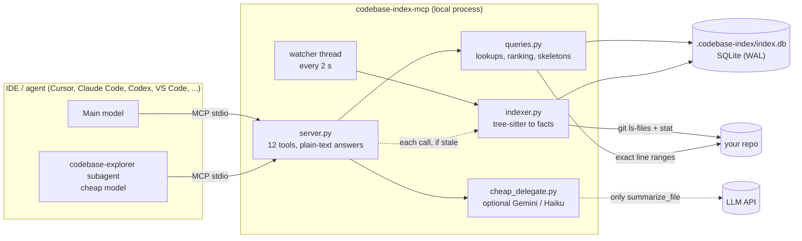
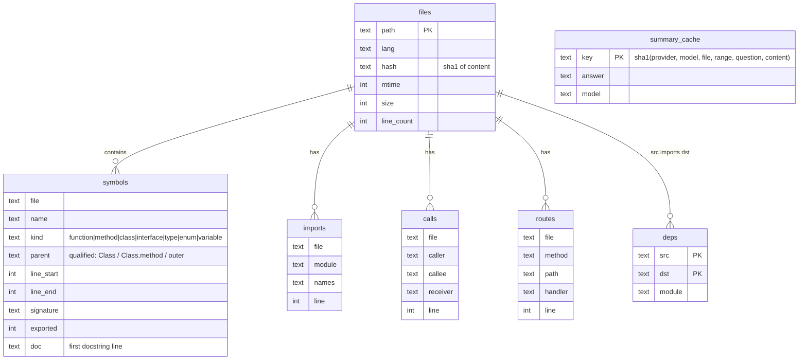

# How it works

## The idea

Coding agents pay for **input tokens**, and every tool result stays in the conversation and is re-sent on
every later turn. Most "where / what / who calls" questions do not need file contents: they need a few facts
(a signature, a line range, a list of call sites). `codebase-index` extracts those facts once with a real
parser, stores them in SQLite, and serves them over MCP.

## Stack

| Piece | Choice | Why |
|---|---|---|
| Parsing | [tree-sitter](https://tree-sitter.github.io/) (`tree-sitter-python`, `-javascript`, `-typescript`) | Real syntax trees, fast, error-tolerant, no LLM, no network |
| Storage | SQLite in WAL mode, one file per repo | Zero setup, fast indexed lookups, safe concurrent readers |
| Protocol | [MCP](https://modelcontextprotocol.io) over stdio (`mcp` SDK 2.x, `MCPServer`) | Works in every major agent client |
| File discovery | `git ls-files` + `stat` | Respects `.gitignore` for free; a stat scan of 749 files takes 0.16 s |
| Ranking | PageRank on the file import graph | `repo_map` shows the files that matter first |
| Optional LLM | Gemini Flash / Claude Haiku via plain HTTPS | Only for `summarize_file`; never required |

## Architecture

| Module | Responsibility |
|---|---|
| `indexer.py` | Lists files, detects changes (mtime/size, then SHA-1), parses with tree-sitter into `symbols`, `imports`, `calls`, `routes`, resolves imports into a file→file `deps` table, runs the watcher |
| `queries.py` | Answers each tool from SQLite; reads exact line ranges **fresh from disk** so answers never show stale code; builds folded skeletons and the repo map |
| `server.py` | Registers the MCP tools (`structured_output=False`), sends routing instructions. **Stdout is the protocol channel; logs go to stderr** |
| `cli.py` | Terminal front-end for every query, plus `setup`, `doctor`, `bench`, `hooks`, `config` |
| `clients.py` | Per-client setup: merges MCP config JSON, edits instruction files between markers, installs subagents |
| `cheap_delegate.py` | Optional `summarize_file` with a content-keyed cache |
| `config.py` | Environment variables, `.env` search, repo-root detection |
| `templates/` | The instruction/rule/subagent files that `setup` installs |

## The indexing pipeline

1. **List** files with `git ls-files` (fallback: directory walk), drop excluded dirs and unsupported extensions.
2. **Detect changes**: compare `mtime` and `size` with the stored row; for changed files compare the SHA-1 of
   the content, so touching a file without changing it costs nothing.
3. **Parse** only real changes. Runs with 2,000+ changed files use a process pool; smaller runs parse
   in-process (process start-up would cost more than it saves).
4. **Extract** per language (see below) into rows.
5. **Resolve imports** into `deps` (file → file), including relative paths, tsconfig `paths`/`baseUrl`, and
   Python packages.
6. **Serve**. Queries use a per-thread read connection; all writers share one lock, so the watcher, tool
   calls and `reindex` never write concurrently.

## What the parser extracts

| | Python | JavaScript / TypeScript / TSX |
|---|---|---|
| Symbols | classes, methods, functions, **nested functions** (parent = `Class.method` / `outer`), module-level variables | functions, classes, methods, class-field arrows, `const X = () => ...`, `memo`/`forwardRef`/`useCallback`/`useMemo` wrappers, **object-literal methods** (`api.getX`), interfaces, types, enums, exported variables, `export default` (named or anonymous) |
| Exported | not `_`-prefixed; `__all__` wins when present | `export`, `export { a }`, `export default X` / `memo(X)` |
| Docs | first line of the docstring | first line of the adjacent `/** */` or `//` comment |
| Imports | `import a.b`, `from .x import y`, `from pkg import mod` | `import`, `export ... from`, `require()`, dynamic `import()` |
| Import resolution | relative imports, packages (`__init__.py`), namespace packages, source roots inferred from the importer's location | relative paths, extension/`index` probing, `.js`→`.ts`, tsconfig/jsconfig `paths` + `baseUrl` (comments and trailing commas allowed) |
| Calls | callee + receiver + enclosing function; bare built-ins (`len`, `str`, ...) skipped | callee + receiver + enclosing function, `new X()`; JS globals (`setTimeout`, `Promise`, ...) skipped |
| Routes | `@router.get("/x")`, `@app.post`, `api_route`, Flask `route(methods=[...])`, `websocket`; `APIRouter(prefix=)` / `Blueprint(url_prefix=)` applied | `app.get("/x", handler)`, `router.post(...)`, `*Router.get(...)` |

## Data model

`meta` holds `schema_version`, `last_sync_at` and `git_head`. Bumping `SCHEMA_VERSION` in `indexer.py` drops
and rebuilds the index automatically on the next start.

## Routing: free tools vs cheap model vs subagent

| Question | Best route | Cost |
|---|---|---|
| Where / shape / callers / imports / routes / code of one function | Index tools | ~0 (local) |
| What does ONE file do? (key configured) | `summarize_file` | one small cheap-model call, cached |
| How does a feature work across files? (Cursor, Claude Code) | `codebase-explorer` subagent | cheap-model usage, in its own context |
| Same, other clients | Index tools, then `read_symbol_source` on the few functions that matter | ~0 |

Routing is **guided, not enforced**, from three places: the MCP server *instructions* (sent at connect),
the tool descriptions, and the rule/instruction file that `codebase-index setup` installs.

## Freshness

See [configuration → freshness](../user-guide/configuration.md#freshness). A sync with no changes costs one `git ls-files`
plus a `stat` per source file. The index records the current git ref and commit (`index_stats`), including
for worktrees and packed refs. Blind spot: **unsaved editor buffers**.

## Performance

- The AST walk visits only named nodes and skips subtrees that cannot contain symbols (strings, comments, type
  annotations): a 749-file full index went from 10.9 s to 3.3 s. Re-check with nothing changed: 0.16 s.
- Queries use per-thread SQLite connections and indexes on name, file, parent, caller, callee and dependency target.
- Files over `CODEBASE_MAX_FILE_BYTES` (1 MB) and binary files are skipped.

## Privacy and security

- Everything except `summarize_file` is local: no network calls, nothing leaves your machine.
- `summarize_file` sends the selected file (or line range) to the provider of the API key you configured.
  Leave the keys empty to stay fully offline.
- The server is read-only with respect to your source code: it never writes inside your repo except its own
  `.codebase-index/` folder. `read_symbol_source` and `summarize_file` refuse paths outside the repo root.
- API keys are read from the environment / `.env` files and are never logged or written to the index.
